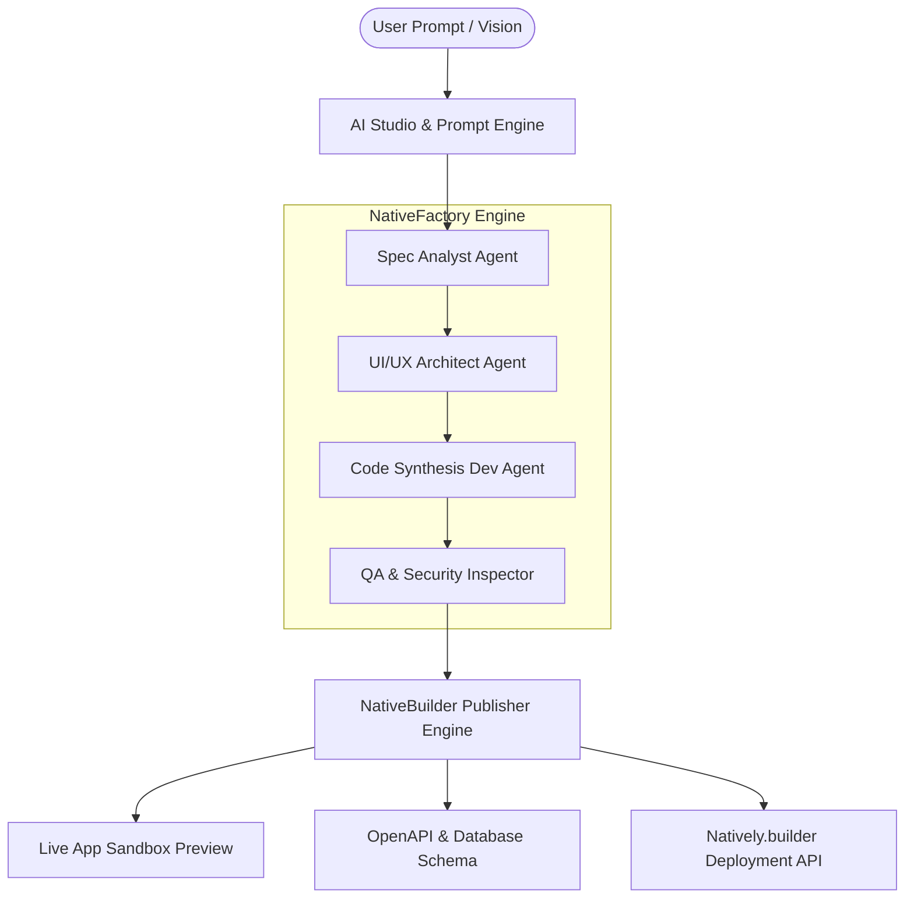

# 🚀 NativeFactory AI — Autonomous Software Factory for NativeBuilder Ecosystem

> **Lablab.ai Hackathon Submission:** NativeBuilder: Build Without Limits (August 3–10, 2026)  
> **Target Platform:** NativeBuilder (NativelyAI Ecosystem)

---

## 📌 Executive Summary

**NativeFactory AI** is an AI-native autonomous software factory and multi-agent workflow orchestration studio designed specifically for the **NativeBuilder / NativelyAI** ecosystem.

It empowers creators, founders, and engineers to transform raw natural language requirements into fully functional, high-performance web applications, database schemas, OpenAPI endpoints, and live working prototypes—ready for seamless 1-click export and deployment into NativeBuilder.

---

## 🌟 Key Features

1. **⚡ Prompt-to-App Agentic Pipeline:**
   - Multi-agent synthesis pipeline: *Spec Analyst Agent* -> *UI/UX Architect Agent* -> *Code Synthesis Engine* -> *QA & Security Inspector* -> *NativeBuilder Publisher*.
   - Live telemetry logs detailing agent reasoning and execution progress.

2. **🎨 Interactive Multi-Agent Workflow Canvas:**
   - Drag-and-drop node graph visualizer connecting agent roles, input/output data ports, and execution dependencies.

3. **💻 Live Interactive Sandbox:**
   - Immediate real-time rendering of generated web applications with desktop, tablet, and mobile viewport preview toggles.

4. **📊 Architecture & Spec Inspector:**
   - Instant generation of OpenAPI 3.0 specs, PostgreSQL / Prisma DB schemas, User Story specs, and Component Trees.

5. **🔗 NativeBuilder Ecosystem Integration:**
   - Built-in manifest generator, direct deployment connectors, and ZIP package export formatted for Natively.builder.

---

## 📐 System Architecture



---

## 🛠️ Tech Stack & Implementation

- **Frontend Core:** HTML5, Modern Vanilla JavaScript (ES2026+), SVG Canvas
- **Design System:** Custom Dark Glassmorphism CSS with HSL variables, Neon accents, and JetBrains Mono / Outfit typography
- **Integration Engine:** JSON Manifest Generator & NativeBuilder Webhook Protocol

---

## 🚀 How to Run Locally

1. Clone or navigate to the repository directory:
   ```bash
   cd /home/deliveryboy/antigravity/gallant-borg
   ```
2. Serve the static files with any HTTP server (e.g. Python, Node.js, or Vite):
   ```bash
   python3 -m http.server 8080
   ```
3. Open `http://localhost:8080` in your web browser.

---

## 🏆 Pitch Video Script & Submission Guide

- **0:00 - 0:15**: Problem Statement (Building complete apps manually takes weeks; static AI landing pages are not enough).
- **0:15 - 0:45**: Demo of NativeFactory AI generating a full FinTech Copilot in seconds.
- **0:45 - 1:15**: Demonstrating the Agent Canvas Graph & Live Sandbox.
- **1:15 - 1:30**: Exporting directly to Natively.builder and closing call to action.
