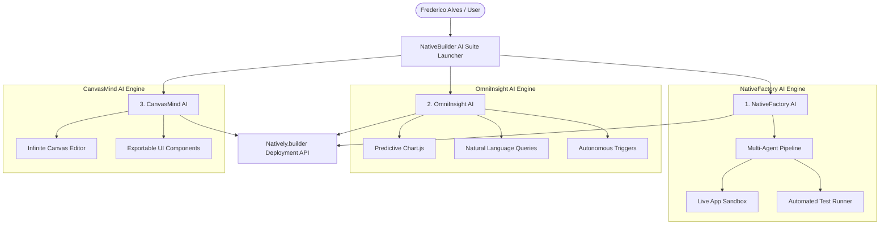

# 🚀 NativeBuilder AI Suite — 3-in-1 Ecosystem by Frederico Alves

> **Lablab.ai Hackathon Submission:** NativeBuilder: Build Without Limits (August 3–10, 2026)  
> **Target Platform:** NativeBuilder (NativelyAI Ecosystem)  
> **Author & Lead Creator:** [Frederico Alves](https://www.linkedin.com/in/frederico-alves-254226393) | GitHub: [@FREDERICO-SISTEMAS-UNIPAM](https://github.com/FREDERICO-SISTEMAS-UNIPAM)  
> **Live Production Vercel URL:** [https://gallant-borg.vercel.app](https://gallant-borg.vercel.app)

---

## 📌 Executive Summary

The **NativeBuilder AI Suite** is a comprehensive, 3-in-1 AI-Native platform developed for the **NativeBuilder (NativelyAI)** ecosystem. It combines three powerful autonomous products into a unified suite:

1. **🏭 NativeFactory AI:** Autonomous Software Factory & Multi-Agent Workflow Engine.
2. **📊 OmniInsight AI:** Real-time Business Intelligence Analytics & Autonomous Action Hub.
3. **🎨 CanvasMind AI:** Infinite Spatial UI Canvas & UX Product Design Copilot.

---

## 🌟 The 3 Ecosystem Applications

### 1. 🏭 NativeFactory AI (Software Factory)
- **Multi-Agent Pipeline:** Spec Analyst -> UI/UX Architect -> Code Synthesis Dev -> QA Inspector -> NativeBuilder Deployer.
- **Live App Sandbox:** Interactive real-time prototype rendering with Desktop, Tablet, and Mobile viewport preview.
- **Automated Test Runner:** E2E & Unit Test suite validator.

### 2. 📊 OmniInsight AI (BI & Action Hub)
- **AI Revenue & Churn Forecast:** Interactive Chart.js predictive financial trend model.
- **Natural Language Data Queries:** Ask complex business questions and receive structured AI insights with 98.5% confidence scores.
- **Autonomous Action Triggers:** Automated WhatsApp invoice reminders and churn retention webhook triggers.

### 3. 🎨 CanvasMind AI (Infinite Spatial UI Canvas)
- **Spatial Wireframe Generator:** Infinite canvas for spatial component composition and user journey mapping.
- **WCAG 2.1 Accessibility Inspector:** Automated dark glassmorphism contrast audit.

---

## 📐 System Architecture

---

## 🚀 Live Production & Deploy

- **Vercel Live URL:** [https://gallant-borg.vercel.app](https://gallant-borg.vercel.app)
- **Natively.builder App:** [https://builder.nativelyai.com](https://builder.nativelyai.com) (Project: `NativeFactory AI`)
- **GitHub Repository:** [https://github.com/FREDERICO-SISTEMAS-UNIPAM/native-factory-ai](https://github.com/FREDERICO-SISTEMAS-UNIPAM/native-factory-ai)
